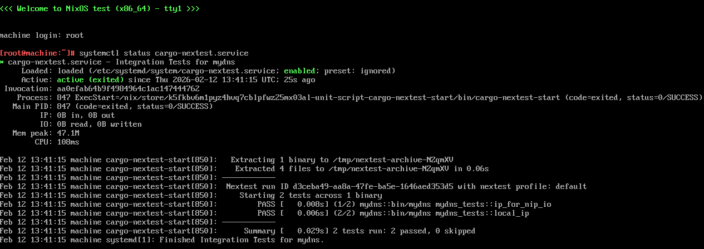

+++
title = "Testes impuros de Rust em Nix com máquinas virtuais"
authors = ["Eric Rodrigues Pires"]
description = "Os desafios de rodar testes impuros com Nix, e uma maneira de rodá-los de forma reproduzível."
date = 2026-02-14
taxonomies.tags = ["Nix", "Rust", "testes"]
+++



```
         .-----------.
        (    OK! =D   )
         `-----. ,---´
               |/
               '
    .----------------------.
    |      __   __  __     |
    |     _\ \__\ \/ /     |
    |    /_______\  / /\   |
    |      / /    \ \/ /_  |
    |   __/ /      \/ __/  |
    |  /_  /\      / /     |
    |   / /\ \____/_/__    |
    |   \/ /  \___  __/    |
    |     /_/\_\  \_\      |
    |                      |
    +----------------------+
   /// __________________ \\\
  /// ____________________ \\\
 /// ______________________ \\\
'------------------------------'
```



Nix é um ótimo sistema não só para distribuir pacotes, mas também para criar ambientes de desenvolvimento reproduzíveis e até mesmo um sistema operacional inteiro. Baseando-se em disciplinas de memória e princípios de programação funcional, ele vem com várias garantias além de limitações.

Uma dessas limitações envolve rodar testes, que costumam ser declarados como derivações (os blocos de montagem de Nix). Embora isso seja conveniente, a _sandbox_ padrão acaba sendo muito difícil de se utilizar, com restrições inesperadas. Este post propõe uma maneira diferente de rodar testes que requerem um ambiente de usuário completo, sem perdermos as funcionalidades que Nix oferece.

Se está com pressa, [pule para a solução](#a-solucao).

## Nosso programa de exemplo

Vamos criar um resolvedor de domínios simples para a linha de comando em Rust, chamado `mydns`. Ele terá duas partes: uma que serve como ponto de partida da CLI, e outro com a lógica principal da aplicação.

```rust,name=main.rs
use std::{
    io::{self},
    net::{IpAddr, ToSocketAddrs},
};

/// Interface da linha de comando do mydns.
fn main() {
    let mut args = std::env::args();
    args.next(); // Pular argumento com o nome do programa
    let host = args.next().expect("argumento deve ser providenciado");
    if args.next().is_some() {
        panic!("Argumentos demais!");
    }
    let ip_list = lista_de_ips_para_host(&host).expect("deve retornar uma lista de IPs para host");
    if ip_list.is_empty() {
        eprintln!("Nenhum IP encontrado!");
    } else {
        for ip in ip_list {
            println!("{ip}");
        }
    }
}

/// Dado um host, retorna a lista de endereços IP resolvidos.
fn lista_de_ips_para_host(host: &str) -> io::Result<Vec<IpAddr>> {
    let socket_addrs = (host, 443).to_socket_addrs()?;
    Ok(socket_addrs.map(|addr| addr.ip()).collect())
}
```

E também vamos escrever alguns testes para garantir o funcionamento básico de `lista_de_ips_para_host`:

```rust,name=main.rs
// ...

#[cfg(test)]
mod mydns_tests {
    use std::net::{IpAddr, Ipv4Addr};

    use crate::lista_de_ips_para_host;

    #[test]
    /// Testa que um endereço IP retorna si mesmo.
    fn local_ip() {
        assert_eq!(
            lista_de_ips_para_host("127.0.0.1").unwrap(),
            vec![IpAddr::V4(Ipv4Addr::new(127, 0, 0, 1))],
        );
    }

    #[test]
    /// Testa que um subdomínio nip.io (que resolve a si mesmo)
    /// retorna o endereço esperado.
    fn ip_for_nip_io() {
        assert_eq!(
            lista_de_ips_para_host("52-0-56-137.nip.io").unwrap(),
            vec![IpAddr::V4(Ipv4Addr::new(52, 0, 56, 137))],
        );
    }
}
```

Se rodarmos `cargo test`, os testes passarão. Perfeito!

## Distribuindo com Nix

Agora que nosso programa simples está pronto, vamos distribuí-lo com Nix. Aqui, eu uso [crane](https://crane.dev) e um [flake](https://nix.dev/concepts/flakes) como exemplo, mas os conceitos podem ser transferidos para qualquer outra configuração.

```nix,name=flake.nix
{
  inputs = {
    nixpkgs.url = "github:NixOS/nixpkgs/nixpkgs-unstable";
    crane.url = "github:ipetkov/crane";
    rust-overlay = {
      url = "github:oxalica/rust-overlay";
      inputs.nixpkgs.follows = "nixpkgs";
    };
  };

  outputs =
    {
      self,
      nixpkgs,
      crane,
      rust-overlay,
      ...
    }:
    let
      systems = [
        "x86_64-linux"
        "aarch64-linux"
        "x86_64-darwin"
        "aarch64-darwin"
      ];

      eachSystem =
        f:
        (builtins.foldl' (
          acc: system:
          let
            fSystem = f system;
          in
          builtins.foldl' (
            acc': attr:
            acc'
            // {
              ${attr} = (acc'.${attr} or { }) // fSystem.${attr};
            }
          ) acc (builtins.attrNames fSystem)
        ) { } systems);
    in
    eachSystem (
      system:
      let
        rustChannel = "stable";
        rustVersion = "latest";

        pkgs = import nixpkgs {
          inherit system;
          overlays = [ (import rust-overlay) ];
        };

        inherit (pkgs) lib;

        craneLib = (crane.mkLib pkgs).overrideToolchain (
          p: p.rust-bin.${rustChannel}.${rustVersion}.default
        );

        src = craneLib.cleanCargoSource ./.;

        commonArgs = {
          inherit src;
          strictDeps = true;
        };

        cargoArtifacts = craneLib.buildDepsOnly commonArgs;

        mydns = craneLib.buildPackage (
          commonArgs
          // {
            inherit cargoArtifacts;
            doCheck = false;
            meta.mainProgram = "mydns";
          }
        );
      in
      {
        packages.${system} = {
          inherit mydns;
          default = mydns;
        };

        apps.${system}.default = {
          type = "app";
          program = lib.getExe mydns;
        };

        devShells.${system}.default = craneLib.devShell {
          checks = self.checks.${system};
          packages = [ pkgs.cargo-nextest ];
        };

        checks.${system} = { };
      }
    );
}
```

Tudo certo até aqui... mas o que nós colocaremos em `checks`? Bem, já que tivémos todo o esforço de escrever uma suite de testes, vamos colocar uma derivação com `cargo nextest`:

```nix,name=flake.nix,hide_lines=1 9
{
checks.${system} = {
  mydns-tests = craneLib.cargoNextest (
    commonArgs
    // {
      inherit cargoArtifacts;
    }
  );
}
```

Agora, vamos tentar rodar nossos testes.

```hl_lines=21-23
$ nix flake check
error: Cannot build '/nix/store/5w1hiyys609bqvmsl4zcqf4w5qpagl6i-mydns-nextest-0.1.0.drv'.
       Reason: builder failed with exit code 100.
       Output paths:
         /nix/store/m6g8yd7wyv8kqgmr29h6chwnvn4b6m10-mydns-nextest-0.1.0
       Last 25 log lines:
       >   stdout ---
       >
       >     running 1 test
       >     test mydns_tests::ip_for_nip_io ... FAILED
       >
       >     failures:
       >
       >     failures:
       >         mydns_tests::ip_for_nip_io
       >
       >     test result: FAILED. 0 passed; 1 failed; 0 ignored; 0 measured; 1 filtered out; finished in 0.00s
       >
       >   stderr ---
       >
       >     thread 'mydns_tests::ip_for_nip_io' (152) panicked at src/main.rs:47:56:
       >     called `Result::unwrap()` on an `Err` value: Custom { kind: Uncategorized, error: "failed to lookup address information: Temporary failure in name resolution" }
       >     note: run with `RUST_BACKTRACE=1` environment variable to display a backtrace
       >
       >   Cancelling due to test failure:
       > ------------
       >      Summary [   0.004s] 2 tests run: 1 passed, 1 failed, 0 skipped
       >         FAIL [   0.003s] mydns::bin/mydns mydns_tests::ip_for_nip_io
       >   Cancelling [ 00:00:00] ============== 2/2: 2 running, 0 passed, 0 skipped
       >              [ 00:00:00] mydns::bin/mydns mydns_tests::local_ip
       > error: test run failedn/mydns mydns_tests::ip_for_nip_io
```

Ops! Por essa eu não esperava...

Vamos olhar os logs de teste mais a fundo, destacados acima. A parte mais importante é _"failed to lookup address information: Temporary failure in name resolution"_.

Derivações de Nix, por padrão, são construídas em um ambiente de _sandbox_. Isso limita acessos ao sistema de arquivos do host que podem trazer impurezas, além de restringir o acesso à rede para entradas que possam ser verificadas criptograficamente via um hash.

Mas isso acaba sendo um problema! Por baixo dos panos, a pesquisa de endereços usa `/etc/hosts` para [resolução estática de nomes](https://man.archlinux.org/man/hosts.5) e, em caso negativo, usa um [resolvedor DNS](https://man.archlinux.org/man/resolv.conf.5) que potencialmente fará uma busca num _nameserver_ externo. E nenhuma dessas ações é permitida numa derivação!

Tipicamente, em um lugar como nixpkgs, o normal é simplesmente pular os testes impuros e garantir na mão que o binário funciona. Mas isso quer dizer que nossa aplicação acaba não sendo testada, e perdemos outras vantagens como usar o [Garnix CI](https://garnix.io/). Isso pode ser adequado para seu caso de uso, mas podemos fazer algo melhor do que isso?

## A solução

Felizmente, nós podemos usar máquinas de NixOS via QEMU para rodar nossos testes em um ambiente controlado! Aqui está uma maneira de fazer isso:

```nix,name=flake.nix,hide_lines=1 64
{
checks.${system} = {
  mydns-tests =
    let
      nextest-archive = craneLib.mkCargoDerivation (
        commonArgs
        // {
          inherit cargoArtifacts;
          doCheck = false;
          pname = "mydns-nextest-archive";
          nativeBuildInputs = (commonArgs.nativeBuildInputs or [ ]) ++ [ pkgs.cargo-nextest ];
          buildPhaseCargoCommand = ''
            cargo nextest archive --archive-format tar-zst --archive-file archive.tar.zst
          '';
          installPhaseCommand = ''
            mkdir -p $out
            cp archive.tar.zst $out
          '';
        }
      );
    in
    pkgs.testers.runNixOSTest {
      name = "mydns-nextest";
      nodes = {
        machine =
          { ... }:
          {
            virtualisation.diskSize = 4096;
            networking.hosts = {
              "52.0.56.137" = [ "52-0-56-137.nip.io" ];
            };
            systemd.services.cargo-nextest = {
              description = "Integration Tests for mydns";
              wantedBy = [ "multi-user.target" ];
              after = [ "network-online.target" ];
              wants = [ "network-online.target" ];
              path = [
                pkgs.cargo
                pkgs.cargo-nextest
              ];
              script = ''
                cp -r ${src}/* .
                cargo nextest run \
                  --archive-file ${nextest-archive}/archive.tar.zst \
                  --workspace-remap .
              '';
              serviceConfig = {
                StateDirectory = "cargo-nextest";
                StateDirectoryMode = "0750";
                WorkingDirectory = "/var/lib/cargo-nextest";
                Type = "oneshot";
                RemainAfterExit = "yes";
                Restart = "no";
              };
            };
          };
      };
      testScript = ''
        machine.start()
        machine.wait_for_unit("cargo-nextest.service")
      '';
    };
};
}
```

Essa parte é bem densa, então vamos passar por ela passo-a-passo.

A ideia principal é que nossos testes sejam compilados em uma derivação no primeiro passo, para então serem rodadas como um serviço do systemd dentro de uma máquina virtual do NixOS no próximo passo, onde cada uma das dependências e pré-requisitos sejam definidos apropriadamente. Por fim, garantimos que esse serviço do systemd concluiu com sucesso.

1. No primeiro passo, nós poderíamos utilizar `cargo test --no-run`, que criaria um binário de teste para nós. Porém, nós precisaríamos extrair o nome exato do binário a partir da derivação. Ao invés disso, vamos usar a [funcionalidade de arquivamento do cargo-nextest](https://nexte.st/docs/ci-features/archiving/) - que é muito mais simples de configurar -, salvando o arquivo na saída da derivação.

```nix,hide_lines=20
let
  nextest-archive = craneLib.mkCargoDerivation (
    commonArgs
    // {
      inherit cargoArtifacts;
      doCheck = false;
      pname = "mydns-nextest-archive";
      nativeBuildInputs = (commonArgs.nativeBuildInputs or [ ]) ++ [ pkgs.cargo-nextest ];
      buildPhaseCargoCommand = ''
        cargo nextest archive --archive-format tar-zst --archive-file archive.tar.zst
      '';
      installPhaseCommand = ''
        mkdir -p $out
        cp archive.tar.zst $out
      '';
    }
  );
in
# ...
{}
```

2. Depois, nós criamos um serviço do systemd `oneshot` que recupera o código-fonte em Rust (necessário para a funcionalidade de arquivamento do nextest) e roda os testes. Nós precisamos copiar os arquivos ao invés de criar um link, já que `cargo nextest` precisa de permissões de escrita ao diretório `target/` no workspace do Cargo (e o `/nix/store` é apenas para leitura). Fora isso, é um serviço systemd que vai direto ao ponto. Eu adicionei comentários abaixo às partes mais importantes.

```nix,hide_lines=1 28
{
systemd.services.cargo-nextest = {
  description = "Integration Tests for mydns";
  wantedBy = [ "multi-user.target" ]; # Faz com que este serviço seja parte do processo de boot normal
  after = [ "network-online.target" ]; # Aguarda até termos acesso à rede
  wants = [ "network-online.target" ]; # Igual ao comentário acima
  path = [
    pkgs.cargo
    pkgs.cargo-nextest
    # Adicione quaisquer outras dependências ao PATH
  ];
  # Desempacote os arquivos fonte e rode cargo nextest
  script = ''
    cp -r ${src}/* .
    cargo nextest run \
      --archive-file ${nextest-archive}/archive.tar.zst \
      --workspace-remap .
  '';
  serviceConfig = {
    StateDirectory = "cargo-nextest"; # Crie o diretório /var/lib/cargo-nextest
    StateDirectoryMode = "0750";
    WorkingDirectory = "/var/lib/cargo-nextest"; # Rode nosso script dentro do 'state directory'
    Type = "oneshot";
    RemainAfterExit = "yes";
    Restart = "no";
  };
};
}
```

3. Agora que nosso arquivo é criado em uma derivação separada, e os testes são realizados no serviço do systemd, tudo que falta é iniciar a máquina virtual que executa e aguarda o serviço. Aqui, nós podemos declarar quaisquer configurações normalmente disponíveis para uma máquina NixOS, e talvez até outras máquinas para conectarmos durante os testes, como um banco de dados. No nosso `testScript`, é essencial que nós aguardemos que o `cargo-nextest.service` conclua e sinalize que o teste foi bem-sucedido.

```nix,hide_lines=1 25
{
pkgs.testers.runNixOSTest {
  name = "mydns-nextest";
  nodes = {
    machine =
      { ... }:
      {
        # Aumente ou diminua o espaço de disco conforme a necessidade
        virtualisation.diskSize = 4096;
        # Adicione configurações adicionais, por exemplo, hosts que devem ser resolvidos
        networking.hosts = {
          "52.0.56.137" = [ "52-0-56-137.nip.io" ];
        };
        systemd.services.cargo-nextest = {
          # -snip-
        };
      };
  };
  # Nosso teste do NixOS consiste em esperar que nosso serviço conclua com sucesso
  testScript = ''
    machine.start()
    machine.wait_for_unit("cargo-nextest.service")
  '';
};
}
```

Agora rode `nix flake check` novamente, que tudo magicamente irá funcionar! Ufa.

Você pode encontrar a [demonstração completa no GitHub](https://github.com/EpicEric/nix-impure-tests-demo).

## Bônus: Interagindo com a VM

Várias das ideias desse post foram tiradas [deste post em inglês por Blake Smith](https://blakesmith.me/2024/03/02/running-nixos-tests-with-flakes.html). Uma coisa legal que ele menciona no artigo é como podemos acessar a máquina virtual interativamente:

```
$ nix run .#checks.x86_64-linux.mydns-tests.driverInteractive

In[1]: machine.start()
```

Uma janela deve aparecer com um shell para a máquina virtual NixOS, onde você pode explorar e inspecionar os resultados do teste:



---

_Precisa de ajuda? [Me mande uma mensagem no Mastodon](https://mastodon.xyz/@epiceric) ou [envie um e-mail](mailto:nix@eric.dev.br)._
