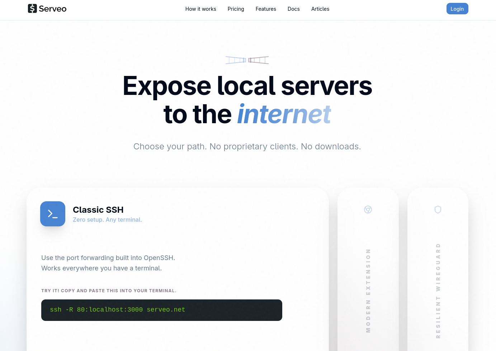
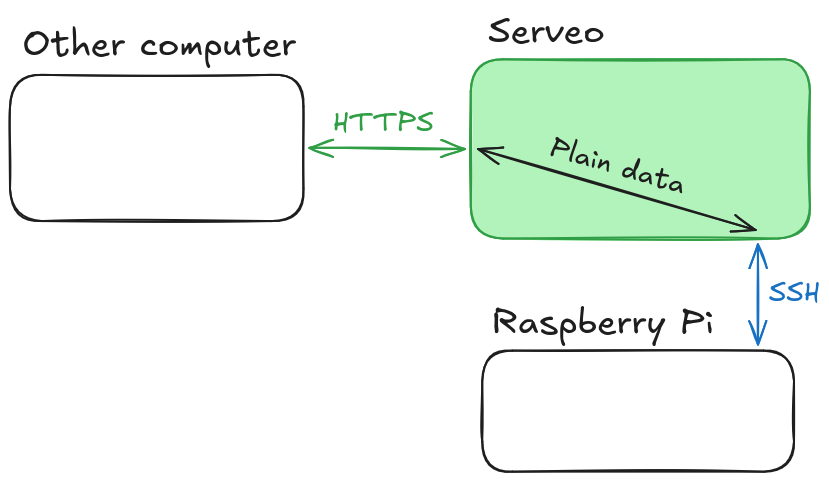
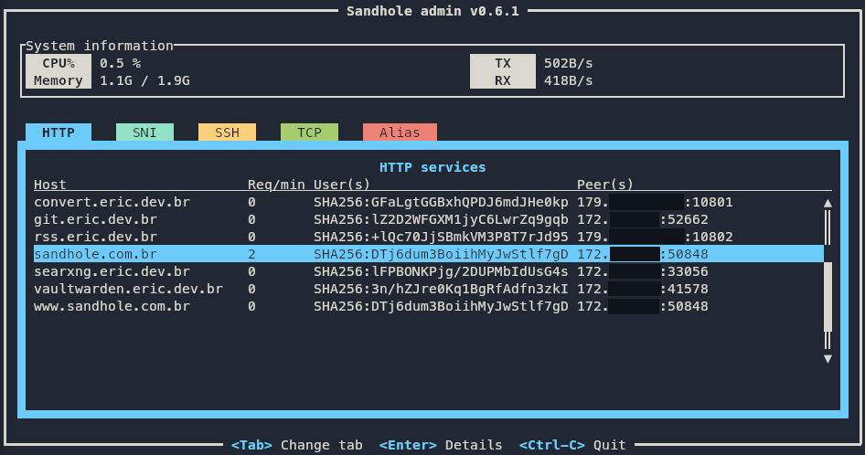

+++
title = "Sandhole under the hood"
authors = ["Eric Rodrigues Pires"]
description = "A long investigation on how reverse port forwarding works in SSH; for fun at first, and then, fully embracing it with Sandhole."
date = 2026-03-24
taxonomies.tags = ["Sandhole", "self-hosting"]
+++



```
.----..--.                                                    _
|    ||==|              S a n d h o l e               ___ ___|_|
|____||  |    ____     .---------------.     ____    |  _| . | |
/::::/|__|===[...°]===| git.eric.dev.br |===[...°]===|_| |  _|_|
                       `---------------´                 |_|
```



This is a long technical post, going over what led me to embrace self-hosting with unconventional reverse proxies.

## A journey of self-host discovery

So I've been getting into self-hosting some of my content, as evidenced by this blog itself. I've never been much of a DevOps/infrastructure guy, but a full-stack developer. Still, I figured: why not try my hand at it? I have a bunch of stuff that I wanted to make available on the web:

- [A Git service](https://forgejo.org/), to self-host my source code without worries about other sites' AI scraping or Terms of Service.
- [A password manager](https://github.com/dani-garcia/vaultwarden), to keep credentials safe and synchronized across multiple devices.
- [A knowledge base](https://www.getoutline.com/), in order to quickly retrieve my notes and share them around.

And more. Plus, I had a [Raspberry Pi](https://www.raspberrypi.com/products/raspberry-pi-3-model-b/) lying around, and it was already online all of the time in order to run a [Discord bot](https://git.eric.dev.br/EpicEric/soup-bot). So how hard could it be?

Well... almost impossible, actually. Never mind that the Raspberry Pi struggled running all of these services at once, that's the least of my issues. No, the _real_ problem is that, even if I have a better computer plugged into my router 24/7, I can't self-host my websites.

And I don't mean buying a [VPS](https://en.wikipedia.org/wiki/Virtual_private_server). I mean _actually_ self-hosting Internet services from my homelab.

If you've had any experience trying to do the same, you are probably wondering if the issue is [Network Address Translation](https://en.wikipedia.org/wiki/Network_address_translation) &ndash; in which case, you'd be correct!

If you're unfamiliar with CGNAT, in short, it means that the address that I access the Internet with doesn't match my router's address. So if I try and expose a server through [port forwarding](https://en.wikipedia.org/wiki/Port_forwarding) on my router, there's no way for any services to listen to it.

Well, bummer. What can we do about it?

One solution is to only use [IPv6](https://en.wikipedia.org/wiki/IPv6). Unfortunately, I have this pesky requirement where I want _anyone_ to access my site. I like IPv6, but it's not [as widespread as it should be](https://www.google.com/intl/en/ipv6/statistics.html#tab=ipv6-adoption).

Another solution &ndash; provided that you're still committed to running your services in your home server &ndash; is to use a proxy server. Instead of our IP, we'll use someone else's IP, which is already exposed to the Internet without any address translation. Then any traffic to our websites gets redirected through a tunnel, and our server transparently responds to them as they come through the network.

That's where something like a [VPN](https://en.wikipedia.org/wiki/Virtual_private_network) really excels at. In fact, I've used Mullvad VPN in the past partially for that reason, while they still had port forwarding from the local computer to the Internet.

And I say _had_, because Mullvad [removed support for port forwarding](https://mullvad.net/en/blog/removing-the-support-for-forwarded-ports), alleging legal reasons for the decision.

Crap. Back to square one...

To their credit, VPNs are excellent for this kind of setup. It's common practice to share data channels between servers through a secure tunnel, over a virtual network. But I personally have three issues with public VPNs (I'll leave the third one as a secret for later; see if you can guess it as a challenge):

1. You generally have to pay for them, or set them up properly, where any mistake can break your security.
2. It requires installing software I'm unfamiliar with, so there's a non-zero chance that it does something shady behind the scenes.
3. <span style="filter:blur(.25rem);">This one is a secret for now!</span>

That's not what I want. Half of the reason I took on this challenge of self-hosting stuff was for fun, to see what I could pull off with minimal effort. Plus, I want results in an afternoon, not over a week. What else can I do...?

## How may I Serveo you?

Some options that I've immediately found were [ngrok](https://ngrok.com/) and [Cloudflare Tunnel](https://www.cloudflare.com/products/tunnel/), both of which are API gateways. In short, they provide you with a tool to expose local servers to the Internet, by connecting to their service through a private tunnel. It's not so different from a VPN, given that it requires using their respective applications.

I was a bit on the fence, since ngrok is a paid service, and Cloudflare requires full control over your [domain](https://en.wikipedia.org/wiki/Domain_Name_System) &ndash; oh, and both are closed-source. But it was interesting to know that things like this already existed. And in my research on Ngrok specifically, I ended up learning about [Serveo](https://serveo.net/).

<figure>



  <figcaption>How the Serveo webpage looks like when it's up. © Trevor Dixon</figcaption>
</figure>

To explain the gist of it, unlike ngrok, you don't pay any fees or install any special tools to use their proxy service. Instead, all you need is an SSH client.

Wait, really?!

Yes really. As it turns out, the secure shell protocol supports what is called a [reverse SSH tunnel](https://goteleport.com/blog/ssh-tunneling-explained/) (definitely read this article if you wanna learn more). In fact, SSH can do much more than simply create a secure session to display a shell from a remote machine &ndash; it's loaded with functionalities that you might not expect it to have!

I was familiar with SSH already, or at least its common use cases. Creating keys, adding them to a server for authentication, [pushing Git commits](https://docs.github.com/en/authentication/connecting-to-github-with-ssh), and so on. It's always been a part of my dev career and, without a doubt, it's one of the fundamental skills you invariably pick up on.

And I'd heard of port forwarding through SSH, but never gave it much thought. But is it really that easy to set up?

Well, I gave it a go, trying out the simple single-line command that the Serveo website told me to follow:

<figure>

```sh
ssh -R git-eric:80:localhost:3000 serveo.net
```

  <figcaption>A very basic reverse SSH tunnel command for Serveo.</figcaption>
</figure>

And, to my delight, it worked! No extra configuration, no tool installation, no questions asked &ndash; my RPi server was live on `git-eric.serveo.net`, and I could access it from any device connected to the Internet!

With a bit more fiddling, I even got my custom domain to work. Pointing the CNAME record to their service, adding a special TXT with my key's fingerprint, and adjusting the command slightly, I got both HTTP and SSH to work, too.

<figure>

```sh
ssh -R git.eric.dev.br:80:localhost:3000 -R git.eric.dev.br:22:localhost:22 serveo.net
```

  <figcaption>Using multiple port forwardings with a custom domain in Serveo.</figcaption>
</figure>

So that's pretty cool, huh? It even supports HTTPS! This feature is specific to Serveo (and most reverse proxy solutions). But to any developer, having HTTPS is not merely a huge plus; [TLS](https://en.wikipedia.org/wiki/Transport_Layer_Security) support is kind of expected out of the box for anything Internet-facing nowadays.

In fact, there's nothing unique about Serveo doing what it does. [localhost.run](https://localhost.run/) works very similarly, by also leveraging an SSH connection as a way to both authenticate the server and pass incoming data through a secure tunnel.

But how is SSH able to do all of this? It might be worth it to go over the fundamentals.

## A SSHort-ish primer

I'll be using the terms OpenSSH and SSH interchangeably, although the former is an implementation of the latter &ndash; the most common implementation, in fact. I'll also make other assumptions and simplifications throughout, so feel free to check the links if you wanna learn more.

When two computers need to communicate over a network, they do so over a connection. That connection happens through sockets, an abstraction at the level of the operating system over finer networking details (such as [addressing and sending electrical bits](https://en.wikipedia.org/wiki/OSI_model)).

For any application, sending and reading data through a socket is [not so different from interacting with files](https://en.wikipedia.org/wiki/Berkeley_sockets). Whether you connect to the Internet to play a game, [access webmail](https://en.wikipedia.org/wiki/Webmail), [access non-web mail](https://en.wikipedia.org/wiki/Internet_Message_Access_Protocol), and so on, your computer is connecting on a network socket (usually [TCP](https://en.wikipedia.org/wiki/Transmission_Control_Protocol)) and sending data to your router, before it traverses the electricity-powered spaghetti that we call the Internet.

The main aspects distinguishing each application on the Internet is what kind of protocol is used for communication, as well as the code running on the server and your machine (usually called "client"). With a previously-agreed [API](https://en.wikipedia.org/wiki/API), both parties can communicate, usually with the server being the authority over the client &ndash; and that model is how [most of the modern web has been built](https://en.wikipedia.org/wiki/Client%E2%80%93server_model).

One such application that runs over the web is SSH, short for [Secure Shell Protocol](https://en.wikipedia.org/wiki/Secure_Shell). It's a cryptographic-based protocol, designed to replace less secure shell protocols from its time, by making sure that all traffic between a server and a client is end-to-end encrypted.

That's a lot of terms in a single sentence, so I'll explain them one by one.

Cryptography is a way to secure communication between two parties, or in our case, two computers over a network. There are mainly two reasons to encrypt (i.e. secure) this communication:

1. To prevent others from spying on the transmitted data. Without a secure channel, things like your password or credit card data would be passed in plaintext, for anybody on the way of your data to see and steal!
2. To prevent others from tampering with the transmitted data. For example, your [ISP](https://en.wikipedia.org/wiki/Internet_service_provider) might decide to inject ads on the pages you access ([that's a real thing!](https://superuser.com/questions/902635/isp-is-inserting-ads-into-web-pages)), or modify/censor the pages you access as it sees fit, without you even realizing that it's happening.

Whenever you access a link that starts with [`https://`](https://en.wikipedia.org/wiki/HTTPS), you're using the secure version of HTTP. While it doesn't mean that you're protected from anything a malicious actor might do (or even that the other side necessarily is who they claim to be), it ensures that your traffic will be protected in the two ways mentioned above. When only the two ends (i.e. the client and the server) can understand the data, we say that the channel is [end-to-end encrypted](https://en.wikipedia.org/wiki/End-to-end_encryption).

Now, what does the [shell](https://en.wikipedia.org/wiki/Unix_shell) in "secure shell" mean? It's a kind of application that comes with every operating system, allowing you to interact with the machine on a high level through text commands, rather than a [graphical interface](https://en.wikipedia.org/wiki/Graphical_user_interface). It requires a [terminal](https://en.wikipedia.org/wiki/Terminal_emulator), like those you see in hacker stock footage, and isn't much different from running any other program, except that all communication is done with individual characters and [escape codes](https://en.wikipedia.org/wiki/Escape_sequence).

Typically, a shell runs on the same machine that it's on, but with SSH or [telnet](https://en.wikipedia.org/wiki/Telnet), you can access a remote shell &ndash; that is, a shell on a remote server.

In order to keep its security guarantees, SSH handles authentication of users (which usually map to users in the operating system) with methods such as a password, keyboard prompts, or most importantly for us, [public keys](https://en.wikipedia.org/wiki/Public-key_cryptography). I won't go over public key cryptography in this post, but suffice it to say that it's a special file that proves that you're really the one accessing the system. For accessing a remote shell, it is pretty useful, and more secure than a simple password.

And that's the way I learned how to use SSH, just a way to use my private key to access a remote server or [transfer files](https://en.wikipedia.org/wiki/Secure_copy_protocol) without giving it much thought. But as we've seen with Serveo, SSH can do more. Much more. It is a viable way of exposing services to the wider Internet, as long as somebody else is willing to proxy the connection for us.

## But is it really secure?

So we've seen that remote SSH forwarding solves two of the problems I had before. I don't need any fancy setup to expose a service, and with Serveo, it's all painless and free. But it still comes at a cost, mainly (and here's the reveal of the third issue that I also had with other solutions):

3. All traffic is passed unencrypted through the proxy.

And, as it turns out, a service like Serveo runs into that same issue.

But wait &ndash; you say &ndash;, I thought all traffic in both HTTPS and SSH was end-to-end encrypted!

And it is, hypothetical reader. But we have to consider which _ends_ are encrypted.

<figure>



  <figcaption>
    From our service (RPi) to the proxy, an SSH tunnel encrypts the session. From the other client to the proxy, HTTPS secures the connection. But what about the middle bit?
  </figcaption>
</figure>

It makes sense, if you think about it. Our [hole punching](<https://en.wikipedia.org/wiki/Hole_punching_(networking)>) solution doesn't do anything special, and all handling of HTTPS traffic is delegated to the proxy server. That means that the proxy server also handles encrypting and decrypting any messages from HTTP or any other TCP connection, thus making us lose the guarantees that the data won't be inspected or modified in some way. This means that any data like passwords _shouldn't_ be sent over our tunnel, as they could be stolen either by Serveo or a hacker who has taken over the service. I knew this going in, so I didn't make the mistake of ever authenticating over the exposed service &ndash; and you shouldn't either!

The fix for this is obvious, as much as it pains me to admit it: I'd have to buy a VPS and host my own solution.

At least this way, I can guarantee that I'm the only one able to interact with the transmitted data, be it encrypted or plain. And before you say "that's still insecure", consider that it's literally what happens with any web server. Plus, even with encryption, [HTTPS doesn't mitigate malice](https://security.stackexchange.com/questions/66355/can-an-https-site-be-malicious-or-unsafe). But in this case, I'm hosting stuff for myself, and I can trust that guy for sure.

But then, I wonder if there's even an open-source version of Serveo that I can use...

## sish happens

It was easy enough to stumble upon [sish](https://github.com/antoniomika/sish) through my searches. It is essentially an open-source version of Serveo (or ngrok, or localhost.run), complete with [a range of configurations](https://docs.ssi.sh/). And as you can see from the image that they host on their website, they offer exactly the same interface:

<figure>


  <figcaption>Even the command is the same: a simple SSH reverse port forwarding! © Antonio Mika</figcaption>
</figure>

After renting a new VPS (I'm personally a fan of Magalu Cloud, or Hetzner for servers outside of Brazil), and setting up an instance of sish through [Docker Compose](<https://en.wikipedia.org/wiki/Containerization_(computing)>) (which simplifies the deployment process a lot), I migrated all my Raspberry Pi services to that proxy. Of course, since "migrating" is just changing the SSH command to point to a different URL, as well as updating some DNS entries, it was a pretty simple process!

Now I have all my services proxied through the sish instance, which can handle HTTPS termination for them &ndash; same as Serveo before. And I can guarantee that the server won't go down sporadically as was the case with Serveo, unless I turn off the virtual machine myself (or it crashes), so that's another bonus.

But my poor RPi still isn't handling the load of so many services at once. Hm. Maybe now that I have a VPS, it's worth offloading some of the services to run on that, instead...

## Less self-hosting is more hosting

I have a few static websites, such as [this blog](https://blog.eric.dev.br) and [my personal website](https://eric.dev.br), which I can keep running basically anywhere. Besides those, there are also services like [my Forgejo instance](https://git.eric.dev.br) that I mentioned earlier, which was running on my RPi and being exposed through sish. But it often causes the mini computer to struggle, whenever it processes too much data or too many requests at once. In this case, it made sense to also move Forgejo to the VPS as well.

And so, I started looking at how to set up some kind of proxy server in front of sish. I'd heard of Traefik and Caddy, two [reverse proxies](https://en.wikipedia.org/wiki/Reverse_proxy) that do some of the annoying stuff, like managing TLS for you. Still, I couldn't find a trivial way to make them work well with sish. Aside from that, despite what I'd been led to believe, they still require a non-minimal amount of effort to set up and maintain &ndash; and I'm still intent on being maximally and efficiently lazy for this whole project.

I even started making a diagram, while trying to explain the architecture that I had in mind to a friend:

<figure>


  <figcaption>
    Recreation of the diagram. My main issue was that I couldn't figure out how to expose sish's functionality through Traefik...
  </figcaption>
</figure>

I wasn't really seeing a way to make this work... But hmm. What Traefik is doing isn't so different from what sish is doing. They are both reverse proxies, in a way, although Traefik is a traditional one, while sish does it in a roundabout way with SSH.

So then I tweaked the diagram a bit...

<figure>


  <figcaption>
    Updated version of the diagram. When I realized that everything &ndash; even internal services &ndash; could connect through SSH, it finally clicked for me!
  </figcaption>
</figure>

Aha! It turns out that exposing services through sish is always the same, whether it's running on the same machine or halfway across the globe. We just need to set our credentials and start a [permanent shell session](https://github.com/Autossh/autossh) that does remote port forwarding for us. With Docker Compose, that's both trivial and safe: no ports get accidentally exposed outside of the container network. And sish even supports advanced features, such as multiple domains and [load balancing](https://docs.ssi.sh/advanced#load-balancing). It's an SSH-powered reverse proxy!

With everything configured just as before, and the appropriate private keys created to authenticate each service, we are able to finally expose multiple services from different sources with a single reverse proxy server. It's all transparent, too, despite how we're using several distinct domains and services, and despite how some of these things are running at my home instead of the VPS. Never mind that I ended pretty much back where I started, it all just works!

It's SSH all the way down!

## Reroute it in Rust

In summary, we started with a simple problem &ndash; getting stuff from my Raspberry Pi to be publicly accessible &ndash; and sish provides us with a two-fold solution:

1. A [reverse proxy](https://en.wikipedia.org/wiki/Reverse_proxy), which will handle and route any incoming traffic to the correct applications.
2. A [hole-punching technique](<https://en.wikipedia.org/wiki/Hole_punching_(networking)>), letting us overcome any limitations that CGNAT imposes.

However, I wasn't satisfied. I hadn't really learned much about the inner workings of SSH or reverse proxies, and I don't find Go (the language that sish is written in) to be approachable, whereas I was more interested in learning about Rust. I wanted to learn more, on my own, and see if I could build my own version of sish.

So I sat down and started writing Rust. tokio, russh, hyper, all libraries to see if I could remote forward a HTTP service with nothing but SSH, and access it through a different port on my localhost. After a lot of struggling with async Rust, I had something minimally working at last!

That's when I realized that I could do all the rest. TCP, aliasing, WebSockets, HTTPS, password authentication, etc. Then add even more. Load balancing, blocklists, user quotas. But I could deviate and do my own things, too! An admin terminal interface via SSH to see and manage services. Rate limiting, connection pools, HTTP/2, load balancing algorithms, profanity filters... What started as a drop-in replacement for sish turned into its own thing deserving of a name: [Sandhole](https://sandhole.com.br). A reverse proxy that I relentlessly use and put to the test on my servers.

<figure>



  <figcaption>Sandhole's slick admin interface via SSH.</figcaption>
</figure>

Now, I'll admit it's not perfect. I still catch bugs every now and then, and it lags behind the Go counterpart in a few benchmarks. But it made me learn so much, and contribute back to the open-source community &ndash; to both sish and the Rust ecosystem. And it's constantly evolving, getting better with each iteration, its code turning less buggy and more idiomatic. And it might be more like a toy compared to actual reverse proxies, due to its hard requirement on OpenSSH. Still, it's the pet project I'm most proud of, and it has enabled me to do so much in terms of self-hosting as well as becoming a better software engineer.

Suffice it to say, I learned a lot about SSH and reverse proxies in general. It's quite fun seeing how this remote forwarding feature has evolved into its own niche ecosystem &ndash; ngrok, Serveo, localhost.run, sish &ndash;, which Sandhole is now a part of.

I could go over the details of how SSH remote forwarding _actually_ works under the hood, but I think I'll leave it for now, as this post is already quite long. If you're interested in an even more technical follow-up post, let me know [on Mastodon](https://mastodon.xyz/@epiceric) or [by e-mail](mailto:sandhole@eric.dev.br). Or if you're interested in running your own Forgejo instance behind Sandhole, what about checking out [this post](/self-hosting-forgejo-with-sandhole/)?
