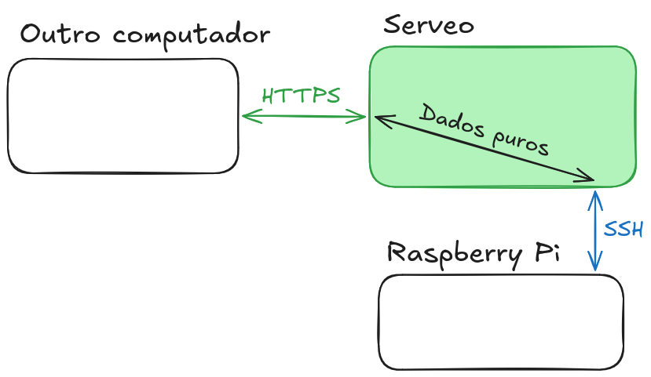

+++
title = "Sandhole por debaixo dos panos"
authors = ["Eric Rodrigues Pires"]
description = "Uma longa investigação sobre como direcionamento reverso de portas funciona no SSH; a princípio por diversão, e depois mergulhando de cabeça com Sandhole."
date = 2026-03-24
taxonomies.tags = ["Sandhole", "hospedagem"]
+++



```
.----..--.                                                    _
|    ||==|              S a n d h o l e               ___ ___|_|
|____||  |    ____     .---------------.     ____    |  _| . | |
/::::/|__|===[...°]===| git.eric.dev.br |===[...°]===|_| |  _|_|
                       `---------------´                 |_|
```



Este é um post técnico longo, detalhando tudo que me levou à auto-hospedagem com _proxies_ reversos não-convencionais.

## Uma jornada de auto-hospedagem descoberta

Eu comecei a fazer auto-hospedagem (ou _self-hosting_) das minhas coisas, como evidenciado por esse próprio blog. Eu nunca fui um cara de DevOps ou infraestrutura, mas um desenvolvedor full-stack. Mesmo assim, eu pensei: por que não experimentar isso? Já que havia vários serviços que eu gostaria de expor na web:

- [Uma forja de Git](https://forgejo.org/)<sup>\[inglês]</sup>, para hospedar meu código fonte sem me preocupar com o scraping para IA ou Termos de Serviço de outros sites.
- [Um gerenciador de senhas](https://github.com/dani-garcia/vaultwarden)<sup>\[inglês]</sup>, para manter minhas credenciais seguras e sincronizadas entre vários dispositivos.
- [Uma base de conhecimento](https://www.getoutline.com/)<sup>\[inglês]</sup>, para facilmente recuperar minhas anotações e compartilhá-las.

E mais. Além disso, eu tinha um [Raspberry Pi](https://www.makerhero.com/produto/raspberry-pi-3-model-b/) parado aqui, que já estava conectado à rede o tempo todo para rodar um [bot do Discord](https://git.eric.dev.br/EpicEric/soup-bot)<sup>\[inglês]</sup>. Então o quão difícil isso poderia ser?

Bem... quase impossível, para ser sincero. Fora o fato de que o Raspberry Pi não aguenta rodar todos estes serviços ao mesmo tempo &ndash; essa é a menor das minhas preocupações. Não, o _verdadeiro_ problema é que, mesmo com um computador melhor conectado no meu roteador 24/7, eu não posso hospedar meus sites.

E eu não estou falando de alugar um [VPS](https://pt.wikipedia.org/wiki/Servidor_virtual_privado). Eu falo de _realmente_ fazer _self-hosting_ de serviços da Internet com meu homelab.

Se você já teve a experiência de tentar o mesmo que eu, você provavelmente está se perguntando se o problema está relacionado a [Network Address Translation](https://pt.wikipedia.org/wiki/Network_address_translation) &ndash; e nesse caso, você teria acertado na mosca!

Se você não tiver familiaridade com CGNAT, resumidamente, quer dizer que o endereço que eu uso para acessar a Internet não corresponde ao endereço do meu roteador. Então, se eu tentar expor um servidor no meu roteador com [redirecionamento de portas](https://pt.wikipedia.org/wiki/Redirecionamento_de_portas), não há nenhuma maneira de meus serviços escutarem na porta do roteador.

Uma pena. O que podemos fazer?

Uma solução seria apenas utilizar [IPv6](https://pt.wikipedia.org/wiki/IPv6). Infelizmente, eu tenho esse requisito chato de que eu gostaria que _qualquer um_ pudesse acessar meu site. IPv6 é legal, mas não é [tão comum quanto deveria ser](https://www.google.com/intl/en/ipv6/statistics.html#tab=ipv6-adoption)<sup>\[inglês]</sup>.

Outra solução &ndash; se você ainda cismar em rodar serviços no servidor doméstico &ndash; seria usar um servidor _proxy_. Ao invés do meu IP, usarei o IP de outra pessoa, que já está exposto à internet sem tradução de endereços. Assim, qualquer tráfego aos nossos websites é redirecionado por um túnel, respondido pelos serviços de forma transparente conforme as requisições chegarem pela rede.

É aqui que algo como uma [VPN](https://pt.wikipedia.org/wiki/Rede_privada_virtual) realmente brilha. Na verdade, eu já usei a Mullvad VPN no passado em parte por essa razão, enquanto eles tinham redirecionamento de portas do computador local à Internet.

E eu digo _tinham_ porque a Mullvad [removeu o suporte a redirecionamento de portas](https://mullvad.net/en/blog/removing-the-support-for-forwarded-ports)<sup>\[inglês]</sup>, alegando razões legais para a decisão.

Saco. De volta à estaca zero...

Esse caso à parte, VPNs em geral são excelentes para este tipo de configuração. Compartilhar canais de dados entre servidores através de um túnel seguro é uma prática comum, através de uma rede virtual. Mas eu tenho três problemas com VPNs públicas (vou esconder o terceiro; como um desafio, tente adivinhar do que se trata):

1. Você geralmente precisa pagar para usá-la, além de configurá-la adequadamente; senão, qualquer erro pode escancarar uma vulnerabilidade.
2. Você precisa instalar software desconhecido, então tem uma chance não-nula de que algo sorrateiro aconteça.
3. <span style="filter:blur(.25rem);">Isso aqui é um segredo por enquanto!</span>

Isso está longe do ideal. Metade da razão pra eu aceitar esse desafio de auto-hospedagem é por diversão, pra ver o que consigo fazer com o mínimo de esforço. Além disso, eu quero ver resultados em uma tarde, não após uma semana. O que mais eu posso fazer...?

## Como que isso Serveo?

Algumas das primeiras alternativas que encontrei foram o [ngrok](https://ngrok.com/)<sup>\[inglês]</sup> e o [Cloudflare Tunnel](https://www.cloudflare.com/products/tunnel/)<sup>\[inglês]</sup>, ambos gateways de API. Em suma, eles fornecem uma ferramenta para expor serviços locais à Internet, permitindo conectar ao serviço deles por um túnel privado. Não são muito diferentes de uma VPN, dado que você ainda precisa rodar aplicações específicas para utilizá-los.

Eu fiquei com uma pulga atrás da orelha, já que o ngrok é pago e o Cloudflare precisa de controle total sobre o seu [domínio](https://pt.wikipedia.org/wiki/Sistema_de_Nomes_de_Dom%C3%ADnio) &ndash; ah, e ambos são _closed-source_. Mas é interessante saber que coisas assim já existem. E, pesquisando mais sobre Ngrok, foi quando me deparei com o [Serveo](https://serveo.net/)<sup>\[inglês]</sup>.

<figure>


  <figcaption>Como a webpage do Serveo parece quando está de pé. © Trevor Dixon</figcaption>
</figure>

Para explicar bem por cima, ao contrário do ngrok, você não paga nenhuma taxa ou instala quaisquer ferramentas especiais para usar o serviço de _proxy_. No lugar disso, tudo o que você precisa é de um cliente SSH.

Pera, sério?!

Sim sério. De fato, o protocol de _shell_ seguro (_secure shell_) suporta o que ele chama de [túnel reverso SSH](https://goteleport.com/blog/ssh-tunneling-explained/)<sup>\[inglês]</sup> (se souber inglês, definitivamente leia este artigo se quiser saber mais). Inclusive, o SSH consegue fazer muito mais do que criar um _shell_ apontando para uma máquina remota &ndash; ele está repleto de funcionalidades que você talvez nem esperaria que ele tivesse!

Eu já havia me familiarizado com SSH ou, pelo menos, com os seus usos mais comuns. Criar chaves, adicioná-las a um servidor para realizar autenticação, [fazer push de commits do Git](https://docs.github.com/en/authentication/connecting-to-github-with-ssh)<sup>\[inglês]</sup> e assim por diante. Ele sempre fez parte da minha carreira como desenvolvedor e, sem dúvidas, é uma das habilidades mais fundamentais que você inevitavelmente precisa aprender.

E eu também já tinha ouvido falar de redirecionamento de portas via SSH, mas nunca dei muita bola para isso. Será que é realmente tão fácil assim de usar?

Bem, eu decidi testar, copiando e colando o singelo comando que o site do Serveo me indicou:

<figure>

```sh
ssh -R git-eric:80:localhost:3000 serveo.net
```

  <figcaption>Um comando de túnel SSH reverso bem básico para o Serveo.</figcaption>
</figure>

Para minha alegria, isso simplesmente funcionou! Nada de configuração a mais ou instalação de ferramentas ou qualquer coisa &ndash; meu servidor do RPi estava disponível em `git-eric.serveo.net` e eu podia acessá-lo de qualquer dispositivo conectado à Internet!

Mexendo mais um pouco com o Serveo, eu até consegui fazer meu domínio personalizado funcionar. Após apontar a entrada CNAME ao serviço deles, adicionar um TXT com a assinatura da minha chave e ajustar o comando um pouco, eu consegui fazer tanto HTTP e SSH funcionarem.

<figure>

```sh
ssh -R git.eric.dev.br:80:localhost:3000 -R git.eric.dev.br:22:localhost:22 serveo.net
```

  <figcaption>Usando múltiplos redirecionamentos de porta com um domínio personalizado no Serveo.</figcaption>
</figure>

Bem bacana, não? Ele até tem suporte a HTTPS! Esta é uma funcionalidade específica do Serveo (e da maior parte dos _proxies_ reversos). Mas qualquer desenvolvedor sabe que ter HTTPS não é só um bônus; suporte a [TLS](https://pt.wikipedia.org/wiki/Transport_Layer_Security) hoje é o básico do básico para qualquer serviço na Internet.

Na realidade, não tem nada de único com o que o Serveo oferece. O [localhost.run](https://localhost.run/)<sup>\[inglês]</sup> funciona de forma similar, utilizando conexões SSH tanto para autenticar o servidor quanto transmitir dados por um túnel seguro.

Mas como é que o SSH é capaz de fazer tudo isso? Talvez valha à pena falar sobre os fundamentos.

## Explicação sem en-SSH-eção

Eu vou usar os termos OpenSSH e SSH de forma intercambiável, embora o primeiro seja uma implementação do segundo &ndash; de fato, a implementação mais comum dele. Eu também vou simplificar e fazer suposições ao longo da explicação, então dê uma olhada nos links se quiser aprender mais.

Quando dois computadores precisam se comunicar em uma rede, eles precisam de uma conexão. Esta conexão acontece por _sockets_ (ou soquetes), uma abstração a nível de sistema operacional sobre os detalhes mais brutos de rede (como [endereçamento ou transmitir bits fisicamente](https://pt.wikipedia.org/wiki/Modelo_OSI)).

Em qualquer aplicação, ler e enviar dados por um soquete [não é tão diferente de interagir com arquivos](https://en.wikipedia.org/wiki/Berkeley_sockets)<sup>\[inglês]</sup>. Esteja você se conectando à Internet para jogar um jogo, [acessar seu webmail](https://pt.wikipedia.org/wiki/Webmail), [acessar seu e-mail não-tão-web](https://pt.wikipedia.org/wiki/Internet_Message_Access_Protocol) e assim por diante, o seu computador se conecta a um soquete de rede (geralmente [TCP](https://pt.wikipedia.org/wiki/Protocolo_de_Controle_de_Transmiss%C3%A3o)) e envia dados ao seu roteador, antes de atravessar o spaghetti movido a eletricidade que chamamos de Internet.

Os principais aspectos que distinguem cada aplicação na Internet são qual tipo de protocol é usado para comunicação e qual o código rodando entre o servidor e sua máquina (geralmente chamada de "cliente"). Seguindo uma [API](https://pt.wikipedia.org/wiki/Interface_de_programa%C3%A7%C3%A3o_de_aplica%C3%A7%C3%B5es) previamente acordada, ambos os lados podem se comunicar, com o servidor geralmente sendo autoritativo sobre o cliente &ndash; e este modelo é com o qual [quase toda a Internet moderna foi construída](https://pt.wikipedia.org/wiki/Modelo_cliente%E2%80%93servidor).

Uma das aplicações que rodam através da web é o SSH, que é uma sigla para [Secure Shell Protocol](https://pt.wikipedia.org/wiki/Secure_Shell). Ele é um protocolo baseado em criptografia, criado para substituir os protocolos de _shell_ menos seguros de sua geração, que garante que todo o tráfego entre o servidor e o cliente é criptografado de ponta a ponta.

Eu sei que eu joguei vários termos novos numa mesma frase, então vou explicá-los um por um.

Criptografia é uma maneira de garantir uma comunicação segura entre dois participantes, ou no nosso caso, entre dois computadores em uma rede. São dois os principais motivos para criptografar (i.e. tornar segura) esta comunicação:

1. Impedir que outros bisbilhotem os dados transmitidos. Sem um canal seguro, coisas como sua senha ou dados do cartão de crédito seriam repassados em texto puro, sendo que qualquer um na rota dos dados poderia ver e copiá-los!
2. Impedir que outros alterem os dados transmitidos. Por exemplo, o seu [provedor de Internet](https://pt.wikipedia.org/wiki/Fornecedor_de_acesso_%C3%A0_internet) poderia decidir injetar propagandas nas páginas que você acessa ([isso já aconteceu mesmo!](https://superuser.com/questions/902635/isp-is-inserting-ads-into-web-pages)<sup>\[inglês]</sup>) ou modificar/censurar as páginas como bem entender, sem você sequer saber que isso aconteceu.

Sempre que você acessa um link que começa com [`https://`](https://pt.wikipedia.org/wiki/HTTPS), você está usando uma versão segura do HTTP. Embora você ainda não garanta proteção contra tudo que um agente malicioso possa fazer (nem tenha certeza que o outro lado realmente é quem diz ser), isso pelo menos garante que seu tráfego estará protegido de forma a impedir que os dois problemas acima ocorram. Quando apenas as duas pontas (i.e. o cliente e o servidor) conseguem entender os dados, nós dizemos que o canal está [criptografado de ponta-a-ponta](https://pt.wikipedia.org/wiki/Criptografia_de_ponta-a-ponta).

Agora, o que que o ["shell"](https://pt.wikipedia.org/wiki/Shell_do_Unix) em "secure shell" quer dizer? Traduzido literalmente para "casca", é um tipo de aplicação que vem com qualquer sistema operacional e que lhe permite interagir com a máquina em um nível alto de abstração com comandos de texto, ao invés de uma [interface gráfica](https://pt.wikipedia.org/wiki/Interface_gr%C3%A1fica_do_utilizador). Ele requer um [terminal](https://en.wikipedia.org/wiki/Terminal_emulator)<sup>\[inglês]</sup>, que nem aqueles que você vê quando mostram vídeos de hacker em notícias e na televisão, que roda como qualquer outro programa, exceto que toda a comunicação ocorre por caracteres e [sequências de _escape_](https://en.wikipedia.org/wiki/Escape_sequence)<sup>\[inglês]</sup> individuais.

Tipicamente, um _shell_ roda na mesma máquina em que é requisitado, mas com SSH ou [telnet](https://pt.wikipedia.org/wiki/Telnet), você pode obter acesso a um _shell_ remoto &ndash; isto é, um _shell_ num servidor remoto.

De forma a garantir segurança, o SSH lida com a autenticação de usuários (que geralmente correspondem aos usuários do sistema operacional) através de métodos como senhas, prompts de teclado ou, mais relevante para nós, [chaves públicas](https://pt.wikipedia.org/wiki/Criptografia_de_chave_p%C3%BAblica). Eu não vou falar sobre criptografia de chave pública neste post, mas basta saber que é um arquivo especial que prova que você realmente é quem diz ser ao acessar o sistema. Para acessar um _shell_ remoto, esta chave é bem útil e mais segura do que usar uma senha.

E foi assim que eu aprendi a usar SSH, como uma forma de usar minha chave privada para acessar um servidor remoto ou [transferir arquivos](https://pt.wikipedia.org/wiki/Secure_copy), sem dar muita bola pra como isso funciona. Mas como vimos com o Serveo, o SSH é mais capaz do que isso. Muito mais. Ele se torna um jeito viável de expor serviços à Internet toda, desde que alguém esteja disposto a fazer o _proxy_ por nós.

## Mas é seguro mesmo?

Nós vimos que o redirecionamento remoto com SSH resolve dois dos problemas que eu tinha antes. Eu não preciso de nenhuma configuração avançada para expor um serviço e, com o Serveo, tudo é indolor e grátis. Mas ainda há um custo, sobretudo (e aqui está a revelação do terceiro problema que também tive com outras soluções):

3. Todo o tráfego no _proxy_ é descriptografado.

Na mesma linha, o Serveo sofre desse problema também.

Mas peraí &ndash; você diz &ndash;, eu pensava que todo o tráfego HTTPS e SSH era criptografado de ponta-a-ponta!

E você tem razão, leitor hipotético. Mas precisamos considerar _quais pontas_ são criptografadas.

<figure>



  <figcaption>
    Do nosso serviço (RPi) ao <em>proxy</em>, um túnel SSH criptografa a sessão. Do outro cliente ao <em>proxy</em>, o HTTPS garante uma conexão segura. Mas e o pedaço do meio?
  </figcaption>
</figure>

Se parar pra pensar, faz sentido. Nossa solução de [_hole punching_](<https://en.wikipedia.org/wiki/Hole_punching_(networking)>)<sup>\[inglês]</sup> não faz nada de especial, portanto, toda a parte de lidar com tráfego HTTPS é delegada ao servidor de _proxy_. Isso quer dizer que o servidor também criptografa e descriptografa quaisquer mensagens que cheguem por HTTP, ou qualquer outra conexão TCP, removendo a garantia de que nossos dados não serão inspecionados ou modificados de alguma forma. Ou seja, dados como senhas _não devem_ ser enviados pelo túnel, já que poderiam ser roubados pelo Serveo ou um hacker que se apossou do serviço. Eu já sabia disso quando comecei, então não usei qualquer tipo de autenticação no meu serviço exposto &ndash; e você também não deveria!

A solução é óbvia, embora me doa admitir: eu preciso alugar um servidor virtual privado e hospedar minha própria solução.

Pelo menos assim eu garanto que sou o único capaz de interagir com os dados transmitidos, sejam criptografados ou puros. E antes que você aponte que "isso ainda é inseguro", considere que isso é literalmente como qualquer servidor web funciona. Além disso, mesmo com criptografia, [HTTPS não mitiga má-fé](https://security.stackexchange.com/questions/66355/can-an-https-site-be-malicious-or-unsafe)<sup>\[inglês]</sup>. Nesse caso, eu que estou hospedando meus próprios serviços, e posso confiar nessa pessoa com certeza.

Mas daí, me pergunto se sequer há uma versão de código aberto do Serveo que eu poderia utilizar...

## Vish, é sish

Eu me deparei com o [sish](https://github.com/antoniomika/sish)<sup>\[inglês]</sup> facilmente nas minhas buscas. Ele é basicamente uma versão _open-source_ do Serveo (ou ngrok, ou localhost.run), incluindo [uma gama de configurações](https://docs.ssi.sh/)<sup>\[inglês]</sup>. E como você pode ver pela imagem hospedada no site deles, eles oferecem exatamente a mesma interface:

<figure>


  <figcaption>Até o comando é o mesmo: um simples redirecionamento reverso de porta com SSH! © Antonio Mika</figcaption>
</figure>

Depois de comprar uma nova VPS (pessoalmente, sou fã da Magalu Cloud, ou Hetzner para servidores fora do Brasil) e configurar uma instância do sish com [Docker Compose](<https://en.wikipedia.org/wiki/Containerization_(computing)>)<sup>\[inglês]</sup> (o que simplificou bastante o processo de _deploy_), eu migrei todos os serviços do Raspberry Pi para o novo _proxy_. Claro, já que "migrar" implica em apenas mudar o apontamento da URL no comando SSH além de atualizar algumas entradas do DNS, foi um processo bem simples!

Agora eu tenho todos os meus serviços sendo expostos pela instância do sish, que é capaz de lidar com a terminação HTTPS deles &ndash; assim como o Serveo fazia antes. E também garanto que minha conexão não vai cair esporadicamente como era com o Serveo, a não ser que eu desligue a máquina virtual ou ela falhe sozinha, então taí outro ponto positivo.

Mas meu pobre RPi ainda não consegue lidar com a carga de tantos serviços simultâneos. Hm. Agora que eu tenho uma VPS, talvez valha à pena mover alguns serviços para que rodem nela diretamente...

## Menos auto-hospedagem é mais hospedagem

Eu tenho alguns sites estáticos, como [este blog](https://blog.eric.dev.br/pt-BR) e [meu site pessoal](https://eric.dev.br), que posso deixar rodando em praticamente qualquer lugar. Fora eles, tenho serviços como [minha instância do Forgejo](https://git.eric.dev.br)<sup>\[inglês]</sup> que eu mencionei anteriormente, que rodava no meu RPi e era exposto via sish. Mas isso fazia com que o mini-computador sofresse de lentidão, seja por processar muitos dados e/ou muitas requisições. Neste caso, faz sentido mover o Forgejo para dentro da VPS também.

Dessa forma, eu comecei a investigar como configurar um servidor de _proxy_ na frente do sish. Eu tinha ouvido falar de Traefik e Caddy, dois [_proxies_ reversos](https://pt.wikipedia.org/wiki/Proxy_reverso) que lidam com as partes chatas, como gerenciar TLS para você. Mesmo assim, eu não conseguia achar uma maneira trivial de fazer eles se comportarem bem junto com o sish. Fora isso, apesar do que eu acreditava, eles ainda requerem uma quantidade não-mínima de esforço para configurar e manter &ndash; e ainda tenho como objetivo deste projeto maximizar quão eficientemente preguiçoso eu consigo ser.

Até comecei a fazer um diagrama enquanto explicava a arquitetura que tinha em mente para um amigo:

<figure>


  <figcaption>
    Recriação do diagrama. Meu maior problema é que eu não sabia como expor a funcionalidade do sish através do Traefik...
  </figcaption>
</figure>

Eu realmente não enxergava uma maneira de fazer isso funcionar... Mas só um segundo. O que o Traefik está fazendo não é muito diferente do sish. De certa forma, ambos são _proxies_ reversos, embora o Traefik seja mais tradicional e o sish use SSH para fazer o mesmo à sua maneira.

Então eu ajustei um pouco o diagrama...

<figure>


  <figcaption>
    Versão atualizada do diagrama. Quando eu percebi que tudo &ndash; até mesmo serviços internos &ndash; poderiam se conectar via SSH, eu tive um momento eureca!
  </figcaption>
</figure>

Ahá! Acontece que expor serviços via sish sempre se dará da mesma forma, esteja ele rodando na mesma máquina ou rodando do outro lado do globo. Nós apenas precisamos configurar nossas credenciais e iniciar uma [sessão _shell_ permanente](https://github.com/Autossh/autossh)<sup>\[inglês]</sup> que faz o redirecionamento de porta remoto para nós. Com Docker Compose, isso é trivial e seguro: nenhuma porta acaba sendo acidentalmente exposta para fora da rede de contêineres. E o sish inclui suporte a funcionalidades avançadas, como múltiplos domínios e [balanceamento de carga](https://docs.ssi.sh/advanced#load-balancing)<sup>\[inglês]</sup>. É um _proxy_ reverso baseado em SSH!

Com tudo configurado da mesma maneira que antes, e criando-se as chaves privadas apropriadas para cada serviço, nós finalmente podemos expor múltiplos serviços de origens diferentes com um único servidor de _proxy_ reverso. E é tudo feito de forma transparente, apesar de termos domínios e serviços distintos, mesmo que algumas dessas coisas estejam rodando em casa ao invés da VPS. Tudo bem que eu voltei basicamente pro ponto de partida, o importante é que funciona!

É tudo SSH, de cabo a rabo!

## Re-roteie em Rust

Em resumo, nós começamos com um problema simples &ndash; como fazer que coisas no meu Raspberry Pi sejam acessíveis publicamente &ndash; e o sish nos deu uma solução dupla:

1. Um [_proxy_ reverso](https://pt.wikipedia.org/wiki/Proxy_reverso), que lida e roteia todo o tráfego que chega às aplicações corretas.
2. Uma [técnica de _hole-punching_](<https://en.wikipedia.org/wiki/Hole_punching_(networking)>)<sup>\[inglês]</sup>, permitindo que nós burlemos as limitações impostas por CGNAT.

Porém, eu não estava satisfeito. Eu não tinha apredindo muito sobre como SSH ou _proxies_ reversos funcionam internamente; e não acho que a linguagem de programação Go (com a qual o sish foi escrito) seja acessível, numa época em que eu tinha mais interesse em mexer com Rust. Eu queria aprender mais, por conta própria, e descobrir se eu poderia criar minha própria versão do sish.

Então eu sentei na frente do computador e comecei a escrever em Rust. tokio, russh, hyper, bibliotecas que talvez me permitiriam fazer o direcionamento remoto de um serviço HTTP com nada além de SSH, para acessar por uma porta diferente no meu localhost. Depois de sofrer muito com Rust assíncrono, eu finalmente tinha algo minimamente funcional!

Foi aí que me toquei que eu poderia fazer o resto. TCP, _aliasing_, WebSockets, HTTPS, autenticação por senha etc. Daí, adicionar ainda mais. Balanceamento de carga, listas de bloqueio, cotas de usuário. Mas eu também podia tomar outro rumo e fazer minhas pŕoprias coisas! Uma interface de terminal de admin que você acessa com SSH para ver e gerenciar serviços. Limitação de taxa de requisiões, _pools_ de conexões, HTTP/2, algoritmos de balanceamento, filtros de palavrão... O que começou como um substituto um-pra-um do sish se tornou algo próprio e digno de nome: [Sandhole](https://sandhole.com.br)<sup>\[inglês]</sup>. Um _proxy_ reverso que eu uso sem dó e ponho à prova em meus servidores.

<figure>


  <figcaption>A interface ligeira SSH de administração do Sandhole.</figcaption>
</figure>

Bem, admito que ele não é perfeito. Ainda encontro bugs de vez em quando, e ele fica atrás da versão em Go em alguns _benchmarks_. Mas eu aprendi muito, e isso me permitiu contribuir à comunidade de código aberto &ndash; tanto ao sish quanto ao ecossistema de Rust. E o Sandhole está em evolução constante, melhorando a cada iteração, seu código ficando com menos bugs e se tornando mais idiomático. Pode até ser um brinquedo perto de _proxies_ reversos reais, já que depende tão fortemente do OpenSSH. Mesmo assim, é o projeto de estimação pelo qual tenho maior estima, que me fez avançar tanto em termos de auto-hospedagem quanto em me tornar um engenheiro de software melhor.

Em poucas palavras, eu aprendi muito sobre SSH e _proxies_ reversos. É bem divertido ver como esta funcionalidade de redirecionamento remoto evoluiu em um ecosistema &ndash; ngrok, Serveo, localhost.run, sish &ndash; do qual agora o Sandhole faz parte.

Eu poderia falar ainda mais sobre como o redirecionamento remoto por SSH _realmente_ funciona por detrás dos panos, mas acho que este post já está longo o bastante. Se você tiver interesse em uma outra postagem ainda mais técnica do que esta, me diga [pelo Mastodon](https://mastodon.xyz/@epiceric) ou [por e-mail](mailto:sandhole@eric.dev.br). Ou se tiver interesse em rodar seu próprio Forgejo atrás do Sandhole, que tal dar uma olhada [neste post](/pt-BR/self-hosting-forgejo-with-sandhole/)?
